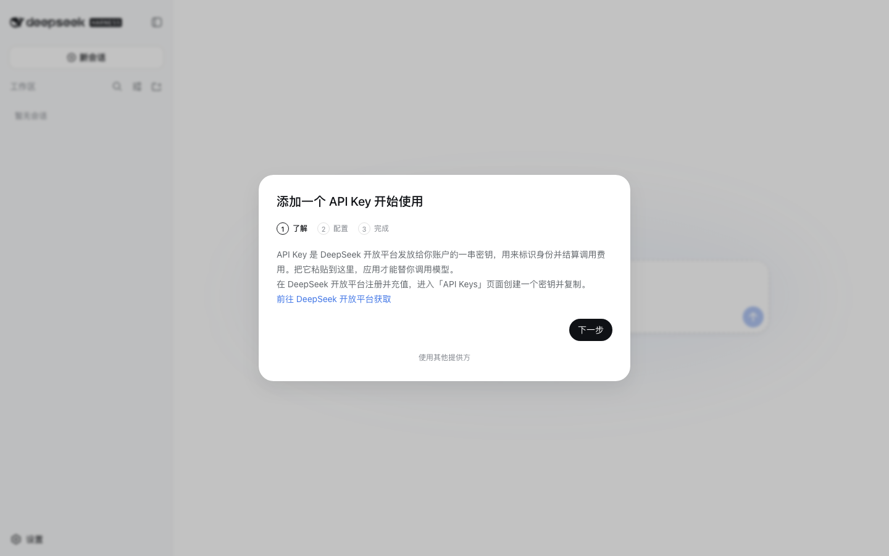
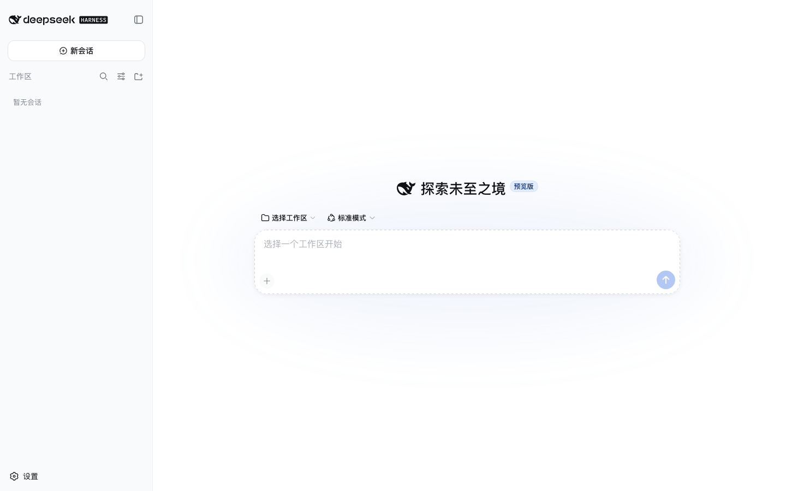
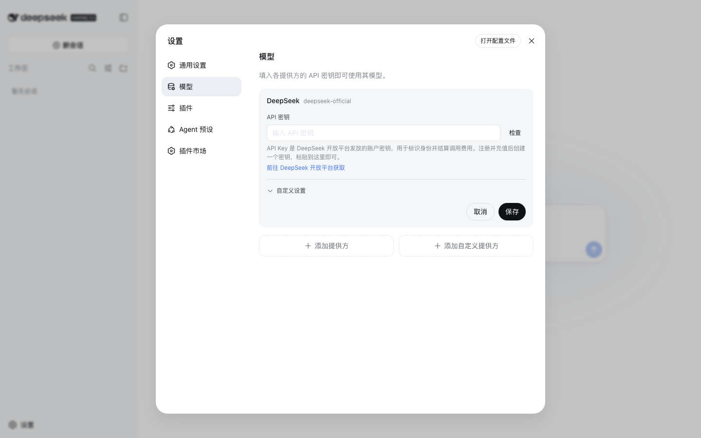

# DeepSeek Harness Desktop

English | [中文](README.zh.md)

**DeepSeek Harness Desktop** is the desktop app for [DeepSeek Harness](https://github.com/deepseek-ai/deepseek-harness), the open-source agent harness from DeepSeek AI. One installer gives you the full agent workspace — no Node.js, no terminal setup.

It is built on an **everything-is-a-plugin** architecture and powered by [Cordis](https://github.com/cordiverse/cordis), whose design is described in [_A Programming Paradigm for Spatiotemporal Composability_](https://arxiv.org/abs/2608.25512).

Upstream documentation: [https://deepseek-harness.github.io/deepseek-harness/](https://deepseek-harness.github.io/deepseek-harness/)

## Download

DeepSeek Harness is in _developer preview_ and iterating rapidly. **THERE WILL BE COMPATIBILITY-BREAKING CHANGES.**

Review the [safety notice](SAFETY.md) before running the project.

Get the latest build from [Releases](https://github.com/marswon/deepseek-harness/releases/latest):

| Platform | File | Notes |
|---|---|---|
| macOS (Apple Silicon) | `DeepSeek-Harness-*-arm64.dmg` | Not signed yet — right-click → **Open** on first launch |
| Windows 10/11 (installer) | `DeepSeek-Harness-Setup-*.exe` | Per-user install, no administrator rights needed |
| Windows 10/11 (portable) | `DeepSeek-Harness-*.exe` | Single file, run from anywhere |
| Linux (Debian/Ubuntu) | `DeepSeek-Harness-*-amd64.deb`, `*-arm64.deb` | Recommended — the only format that keeps the sandbox enabled on Ubuntu 24.04+ |
| Linux (portable) | `DeepSeek-Harness-*-x86_64.AppImage`, `*-arm64.AppImage` | For non-Debian distributions; runs unsandboxed on Ubuntu 24.04+ |

On Linux, prefer the `.deb`: Ubuntu 24.04 and later restrict unprivileged user namespaces, and only a package with an install script can register the AppArmor profile that lets the app keep its sandbox. Install it with `sudo dpkg -i DeepSeek-Harness-*.deb` (follow with `sudo apt-get -f install` if dependencies are missing). An AppImage cannot register that profile and therefore starts with its sandbox disabled; an arm64 AppImage also needs `libfuse2` on the host.

After install, the app downloads updates in the background and applies them on restart. A `.deb` update asks for your password, because installing the package needs root.

## Screenshots

## Features

- **Ready out of the box** — the runtime and web UI ship inside the installer; install and start a session, nothing else to set up.
- **Guided first run** — a setup wizard walks you through getting a DeepSeek API key, pasting it in, and verifying it before your first session.
- **Plugin marketplace** — browse and install community plugins from **Settings → Plugin Market**, powered by [dshmarket](https://github.com/dsh-market/dsh-market).
- **Workspace at hand** — jump straight to a workspace folder, or reveal any file the agent generated in Finder/Explorer directly from the session.
- **File attachments** — attach code and text files inline, or drop in PDF, Word, Excel, and PowerPoint documents; the app extracts their text locally before sending.
- **Automatic updates** — new versions download in the background and install on restart.

## Security notes

- macOS builds are not yet signed with an Apple Developer certificate, so Gatekeeper warns on first launch; right-click the app and choose **Open**.
- Windows builds install per user and never ask for administrator rights.
- Linux `.deb` packages install an AppArmor profile so the renderer stays sandboxed on Ubuntu 24.04+; the AppImage runs it unsandboxed. Verify the profile with `aa-status | grep -i deepseek` after installing.
- Marketplace plugins are third-party code running with the agent's permissions; install only plugins you trust.

## Relationship to upstream

This repository forks [deepseek-ai/deepseek-harness](https://github.com/deepseek-ai/deepseek-harness) and adds the desktop shell (`apps/desktop`), the onboarding wizard, and the bundled plugin market. The harness core tracks upstream. See [docs/architecture.md](docs/architecture.md) for the architecture and [AGENTS.md](AGENTS.md) for contributor guidance.

Upstream community: submit feedback or bug reports through [GitHub Discussions](https://github.com/deepseek-ai/deepseek-harness/discussions), add the [`dsh-plugin`](https://github.com/topics/dsh-plugin) topic to your plugin repository for discoverability, or join the <a href="https://discord.gg/Ycq5dCaS4">DeepSeek Harness Discord community</a>.

## Contributing

See [CONTRIBUTING.md](CONTRIBUTING.md).

## Development

Start with the [development guide](docs/development.md) and [architecture documentation](docs/architecture.md). For agents, follow [AGENTS.md](AGENTS.md).

## License

[MIT](LICENSE)

Third-party dependencies and their licenses are disclosed in [THIRD_PARTY_NOTICES.md](THIRD_PARTY_NOTICES.md).
